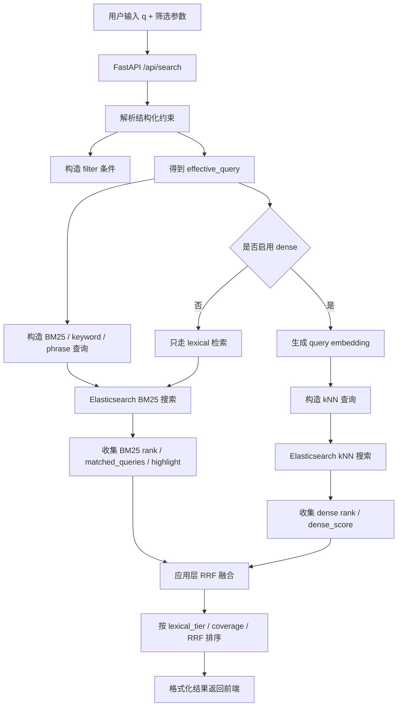

# 简历检索系统

这是一个面向简历筛选场景的 Elasticsearch 混合检索原型。项目用 FastAPI 提供搜索接口，用 Elasticsearch 承载结构化字段检索、中文 BM25 全文检索、连续短语匹配、向量近邻检索，并在应用层实现 RRF 融合排序。

本文档的目标不是只告诉你“怎么启动项目”，而是帮助你系统理解项目的业务背景、数据链路、字段设计、Elasticsearch 查询 DSL、排序策略和技术取舍。读完后，应当能够比较完整地向面试官说明：

- 这个项目为什么需要混合检索。
- keyword、phrase、BM25、filter、dense vector 分别解决什么问题。
- 用户输入如何被解析成 Elasticsearch 查询。
- 搜索结果如何从 BM25 和向量检索融合而来。
- 为什么某些字段必须精确匹配，某些字段适合分词搜索，某些字段只应该过滤。
- 如果数据量变大，应该从哪些方向优化。

开发过程中的问题复盘和面试表达补充见 [PROJECT_REVIEW.md](./PROJECT_REVIEW.md)。

## 目录

- [1. 项目整体介绍](#1-项目整体介绍)
- [2. 项目架构设计](#2-项目架构设计)
- [3. 核心概念解释](#3-核心概念解释)
- [4. Elasticsearch Mapping 与索引设计](#4-elasticsearch-mapping-与索引设计)
- [5. 用户输入解析](#5-用户输入解析)
- [6. 搜索逻辑与 Elasticsearch DSL](#6-搜索逻辑与-elasticsearch-dsl)
- [7. 排序与融合逻辑](#7-排序与融合逻辑)
- [8. 字段匹配规则](#8-字段匹配规则)
- [9. 代码实现概览](#9-代码实现概览)
- [10. 完整搜索示例](#10-完整搜索示例)
- [11. 检索效果评估](#11-检索效果评估)
- [12. 本地运行与验证](#12-本地运行与验证)
- [13. 设计取舍与面试重点](#13-设计取舍与面试重点)
- [14. 当前边界与需要补充的信息](#14-当前边界与需要补充的信息)

## 1. 项目整体介绍

### 1.1 这个项目解决什么问题

简历检索不是普通的全文搜索。用户可能输入非常不同类型的查询：

| 查询类型 | 用户输入示例 | 用户真实意图 |
| --- | --- | --- |
| 编号查询 | `A0009`、`M20260001` | 找某个岗位或某份简历 |
| 实体查询 | `北京交通大学`、`百度在线网络技术` | 找指定学校或公司背景 |
| 专业查询 | `计算机科学`、`计算机科学与技术` | 专业字段中连续短语或完整专业优先 |
| 技能查询 | `Python NLP SQL` | 找同时具备多个技能或能力的人 |
| 结构化筛选 | `北京 本科 0.5年以上 推荐系统` | 在城市、学历、年限、技能约束下搜索 |
| 自然语言能力查询 | `做过推荐系统召回和 NLP 模型落地的人` | 找经历语义相近的人 |

这些查询不能只靠一种技术解决：

- 只用 keyword：无法理解自然语言描述，也无法处理职责、项目、能力语义。
- 只用 BM25：能做关键词相关性，但对“模型落地”“召回链路”这类表达的语义泛化有限。
- 只用向量：容易把实体查询泛化错，例如搜索 `北京大学` 却召回 `北京交通大学` 或 `北京` 城市相关候选人。
- 只用 filter：太硬，召回容易为 0，也不能排序。

因此项目采用混合检索：

```text
keyword / phrase / BM25 负责“字段上明确写了什么”
filter 负责“必须满足哪些结构化条件”
dense vector 负责“经历和能力在语义上像不像”
RRF 负责把词面检索和向量检索的排名融合起来
```

### 1.2 核心业务场景

业务场景是招聘或实习简历筛选。系统面向的用户可以是招聘人员、业务面试官或筛选系统。他们希望通过一个搜索框和若干筛选条件，快速找到符合岗位要求的候选人。

典型任务包括：

- 搜索特定岗位编号下的候选人。
- 搜索特定学校、专业、公司背景。
- 搜索具备某些技能组合的人。
- 搜索做过某类项目、模型、系统、漏洞挖掘或数据分析工作的人。
- 对搜索结果进行排序，让最符合意图的人排在前面。

### 1.3 用户输入是什么

搜索接口位于 `GET /api/search`，主要输入参数如下：

| 参数 | 类型 | 含义 | 示例 |
| --- | --- | --- | --- |
| `q` | string | 搜索框里的自由文本，可以是编号、学校、专业、技能、自然语言描述 | `计算机科学` |
| `degree` | string | 显式学历筛选 | `本科`、`硕士` |
| `cities` | list[string] | 显式期望城市筛选 | `北京`、`上海` |
| `skills` | list[string] | 显式技能筛选，多个技能是 AND 关系 | `Python`、`NLP` |
| `min_years` | float | 最低工作或实习年限 | `0.5` |
| `limit` | int | 返回结果数量。`0` 或不传表示使用默认窗口 | `20` |

除了显式参数，系统也会从 `q` 中轻量识别结构化条件。例如：

```text
q = "0.5年以上 北京 本科 推荐系统"
```

会被解析成：

```text
query_text = "推荐系统"
filters:
  candidate.years_experience >= 0.5
  application.expected_work_cities contains 北京
  candidate.highest_degree = 本科
  skills contains 推荐系统
```

### 1.4 系统输出是什么

接口返回 JSON，核心字段包括：

| 字段 | 含义 |
| --- | --- |
| `query` | 用户原始查询 |
| `effective_query` | 结构化解析后真正进入文本检索的 query |
| `parsed_constraints` | 从自然语言里解析出的结构化约束 |
| `matched_total` | BM25 / keyword / phrase / filter 侧命中的业务总数 |
| `candidate_total` | 进入融合排序并被接受的候选数量 |
| `returned_count` | 当前响应实际返回数量 |
| `retrieval_warnings` | 某一路检索失败或降级时的 warning |
| `results` | 搜索结果列表 |
| `facets` | 前端筛选面板需要的学历、城市、技能、岗位聚合 |

每条结果会包含候选人摘要、教育经历、技能、项目片段、高亮片段和调试信息。调试信息对排查排序很重要：

```json
{
  "retrieval_debug": {
    "retrieval_sources": ["bm25", "dense"],
    "bm25_rank": 3,
    "dense_rank": 12,
    "dense_route_rank": 4,
    "dense_field": "projects_vector",
    "dense_inner_score": 0.052104,
    "dense_rrf_contribution": 0.013889,
    "rrf_score": 0.027367,
    "lexical_tier": 2,
    "term_coverage": 2
  }
}
```

### 1.5 从输入到结果返回的整体流程



## 2. 项目架构设计

### 2.1 整体架构

项目由五个核心部分组成：

| 层级 | 主要文件 | 作用 |
| --- | --- | --- |
| 简历解析层 | `resume_parser.py` | 从本地简历文件中抽取结构化字段 |
| 索引构建层 | `import_to_es.py` | 定义 ES mapping，构建搜索文本，生成 embedding，批量写入 ES |
| 向量生成层 | `embedding_service.py` | 加载 embedding 模型，提供单条和批量编码 |
| 搜索服务层 | `app.py` | FastAPI 接口、查询解析、ES DSL 构造、混合检索、RRF 排序 |
| 效果评估层 | `evaluate_search.py`、`eval_queries.jsonl` | 用标注 query 评估 P@K、R@K、MRR、NDCG、负例误召回 |
| 前端展示层 | `web/` | 搜索框、筛选条件、结果列表、详情查看 |

### 2.2 数据从输入到输出的完整链路

索引构建链路：

```text
本地简历文件
  -> resume_parser.py 解析成结构化 JSON
  -> import_to_es.py 补充工作年限、skills_text、embedding 元信息
  -> embedding_service.py 生成技能、项目、实习、教育四路画像向量
  -> Elasticsearch 建索引并 bulk 写入
  -> resumes_current alias 指向最新索引
```

查询链路：

```text
用户搜索
  -> /api/search
  -> 解析 q 中的城市、学历、年限、技能
  -> 构造 bool query:
       must: lexical query
       filter: 结构化硬过滤
  -> 并发执行:
       BM25 / keyword / phrase 查询
       dense_vector kNN 查询
  -> 应用层合并两路结果
  -> lexical_tier / term_coverage / RRF 排序
  -> 返回结果、facet、debug 信息
```

### 2.3 为什么需要 alias

导入脚本默认使用：

```text
index: resumes_v1_时间戳
alias: resumes_current
```

重建索引时先写入新 index，校验成功后再切换 alias。这样查询服务始终访问 `resumes_current`，不需要知道真实索引名。

当前代码只支持最新 mapping，不兼容缺少多路画像向量、`.keyword` 或 `.phrase` 子字段的旧索引。mapping 变化后应重建新索引。

## 3. 核心概念解释

### 3.1 keyword 是什么

`keyword` 是 Elasticsearch 中不分词的字段类型。它把整个字段值当成一个完整 token，用于精确匹配、过滤、聚合和排序。

例子：

```json
{
  "candidate": {
    "school": "北京交通大学"
  }
}
```

如果 `candidate.school.keyword = 北京交通大学`，那么查询：

```json
{"term": {"candidate.school.keyword": "北京交通大学"}}
```

只会命中完整等于 `北京交通大学` 的字段，不会因为只包含 `北京` 或 `交通` 就命中。

本项目适合 keyword 的字段：

- `application.candidate_no`
- `application.position_code`
- `candidate.name.keyword`
- `candidate.school.keyword`
- `candidate.major.keyword`
- `education.school.keyword`
- `education.major.keyword`
- `internships.company.keyword`
- `projects.name.keyword`
- `skills`
- `candidate.highest_degree`
- `application.expected_work_cities`

### 3.2 phrase 是什么

`phrase` 指连续短语匹配。用户搜索 `计算机科学` 时，系统希望：

```text
计算机科学与技术
计算机科学学院
```

优先于只分散出现 `计算机` 和 `科学` 的文档。

本项目给关键 text 字段增加 `.phrase` 子字段：

```json
"candidate.major": {
  "type": "text",
  "analyzer": "resume_text",
  "search_analyzer": "resume_search",
  "fields": {
    "keyword": {"type": "keyword"},
    "phrase": {
      "type": "text",
      "analyzer": "resume_search",
      "search_analyzer": "resume_search"
    }
  }
}
```

为什么不用主字段直接 `match_phrase`？

主字段使用 `ik_max_word` 建索引。`ik_max_word` 会产生更多 token，有利于宽召回，但会产生重叠和位置问题，某些连续短语匹配不稳定。因此 `.phrase` 子字段使用 `ik_smart` 建索引，专门服务 `match_phrase`。

### 3.3 filter 是什么

`filter` 是 Elasticsearch bool query 中的硬过滤条件。它只决定文档是否保留，不参与相关性评分。

例子：

```json
{
  "bool": {
    "must": [
      {"match": {"skills_text": "推荐系统"}}
    ],
    "filter": [
      {"term": {"candidate.highest_degree": "本科"}},
      {"terms": {"application.expected_work_cities": ["北京"]}},
      {"range": {"candidate.years_experience": {"gte": 0.5}}}
    ]
  }
}
```

上面的 `filter` 表示：

- 必须是本科。
- 期望城市必须包含北京。
- 工作年限必须大于等于 0.5。

这些条件不影响 `_score`。原因是它们更像业务约束，不是相关性证据。一个候选人只要满足本科，就不应该因为“本科”这个字段出现而比另一个本科候选人分数更高。

### 3.4 query 是如何构造的

项目中的查询分三层：

```text
外层 bool query
  must:
    lexical query
  filter:
    结构化过滤条件

lexical query
  should:
    exact keyword 查询
    phrase 查询
    multi_match AND 查询
    multi_match OR 查询
    nested 查询

dense query
  knn:
    field = skills_vector / projects_vector / internships_vector / education_vector
    query_vector = encode_single(query_text)
    filter = 同一组结构化过滤条件
```

注意：

- `must` 表示文本检索必须至少命中一类 lexical 条件。
- `should` 表示多个召回证据，至少命中一个即可。
- `filter` 表示硬约束，不参与评分。
- dense kNN 和 BM25 并发执行，最后由应用层融合。

### 3.5 用户输入中的字段含义

| 输入来源 | 含义 | 处理方式 |
| --- | --- | --- |
| `q` | 搜索框自由文本 | 可解析出约束，剩余部分进入 lexical 和 dense |
| `degree` | 显式学历筛选 | `term candidate.highest_degree` |
| `cities` | 显式城市筛选 | `terms application.expected_work_cities` |
| `skills` | 显式技能筛选 | 多个 `term/terms skills`，AND 语义 |
| `min_years` | 显式最低年限 | `range candidate.years_experience.gte` |
| `limit` | 返回数量 | `0` 或不传时使用 `MAX_BROWSE_RESULT_SIZE=10000` |

### 3.6 哪些字段影响召回、过滤和排序

| 字段类型 | 影响召回 | 影响过滤 | 影响排序 | 示例 |
| --- | --- | --- | --- | --- |
| keyword exact 字段 | 是 | 有时是 | 是 | `candidate.major.keyword` |
| phrase 字段 | 是 | 否 | 是 | `candidate.major.phrase` |
| text BM25 字段 | 是 | 否 | 是 | `section_text.projects` |
| filter 字段 | 否 | 是 | 否 | `candidate.highest_degree` |
| dense vector | 是 | 可附带 filter | 是 | `skills_vector`、`projects_vector`、`internships_vector`、`education_vector` |
| date/number 字段 | 通常否 | 是 | 可排序或过滤 | `application.apply_time` |

## 4. Elasticsearch Mapping 与索引设计

### 4.1 analyzer 设计

项目定义了两个中文 analyzer：

```json
{
  "analysis": {
    "analyzer": {
      "resume_text": {
        "type": "custom",
        "tokenizer": "ik_max_word",
        "filter": ["lowercase"]
      },
      "resume_search": {
        "type": "custom",
        "tokenizer": "ik_smart",
        "filter": ["lowercase"]
      }
    }
  }
}
```

两者分工：

| analyzer | tokenizer | 用途 |
| --- | --- | --- |
| `resume_text` | `ik_max_word` | 主 text 字段索引，尽量多切词，提高召回 |
| `resume_search` | `ik_smart` | 搜索分析器和 `.phrase` 子字段，减少噪声，保证短语位置更稳定 |

例子：

```text
文本: 计算机科学与技术

resume_text 可能产生:
  计算机 / 计算 / 算机 / 科学 / 与 / 技术

resume_search 产生:
  计算机 / 科学 / 与 / 技术
```

主字段用 `ik_max_word`，适合普通 BM25 宽召回。`.phrase` 子字段用 `ik_smart`，适合连续短语匹配。

### 4.2 text + keyword + phrase 的 multi-field 设计

很多字段同时支持三种查询方式：

```json
"major": {
  "type": "text",
  "analyzer": "resume_text",
  "search_analyzer": "resume_search",
  "fields": {
    "keyword": {"type": "keyword"},
    "phrase": {
      "type": "text",
      "analyzer": "resume_search",
      "search_analyzer": "resume_search"
    }
  }
}
```

同一个业务字段对应三种检索能力：

| 字段 | 查询方式 | 作用 |
| --- | --- | --- |
| `candidate.major.keyword` | `term` | 字段整体完全等于 query |
| `candidate.major.phrase` | `match_phrase` | query 作为连续短语出现 |
| `candidate.major` | `match` / `multi_match` | 分词后的普通 BM25 检索 |

这正是项目能处理 `计算机科学` 和 `计算机科学与技术` 的关键。

### 4.3 dense_vector 设计

当前使用多路画像向量，而不是只把整份简历压成一个向量：

```json
"projects_vector": {
  "type": "dense_vector",
  "dims": 1792,
  "similarity": "cosine",
  "index": true,
  "index_options": {
    "type": "hnsw",
    "m": 32,
    "ef_construction": 300
  }
}
```

同样的 `dense_vector` mapping 会用于：

- `skills_vector`：技能画像。
- `projects_vector`：项目画像。
- `internships_vector`：实习/工作经历画像。
- `education_vector`：教育、专业、研究方向画像。

岗位名称、岗位编号和求职意向不再单独向量化，主要由 BM25、keyword 和 phrase 查询负责。

设计含义：

- `dims=1792` 必须和 embedding 模型输出维度一致。
- `similarity=cosine` 使用余弦相似度。
- `index=true` 表示支持近似最近邻检索。
- HNSW 参数用于向量索引构建，`m` 和 `ef_construction` 越大，召回通常越好，但索引更大、构建更慢。

### 4.4 embedding 契约

索引 `_meta` 记录 embedding 契约：

```yaml
embedding_model_id: IEITYuan/Yuan-embedding-2.0-zh
embedding_vector_dims: 1792
embedding_normalized: true
semantic_profile_version: semantic-profile-v5
embedding_vector_fields:
  - skills_vector
  - projects_vector
  - internships_vector
  - education_vector
```

每条文档也写入：

```text
embedding.model_id
embedding.vector_dims
embedding.normalized
embedding.semantic_profile_version
```

这样可以排查：

- 查询向量和文档向量是否来自同一个模型。
- 向量维度是否一致。
- semantic profile 是否使用同一套拼接逻辑。

### 4.5 为什么不是全文向量化

项目没有把整份简历直接向量化，原因是：

- embedding 模型有长度上限，真实简历很容易超长。
- 联系方式、城市、学校、公司等实体进入向量后会污染语义检索。
- 简历中很多内容是结构化字段，应该分别服务过滤、精确匹配和语义匹配。

当前向量输入是抽取式分字段画像：

- 技能画像：技能标签。
- 项目画像：项目名称、描述、职责。
- 实习画像：实习部门、职位、描述。
- 教育画像：教育专业、研究方向、实验室方向。

岗位相关字段不进入 dense 向量：

- 目标岗位。
- 求职意向。
- 岗位编号。

这些字段更适合通过 BM25、keyword 或 phrase 做明确匹配。

明确排除：

- 姓名、手机号、邮箱。
- 学校、城市、公司。
- 候选人编号、岗位编号。

## 5. 用户输入解析

### 5.1 显式筛选参数

显式参数直接转成 filter：

| 参数 | ES 查询 |
| --- | --- |
| `degree=本科` | `term candidate.highest_degree = 本科` |
| `cities=北京&cities=上海` | `terms application.expected_work_cities = [北京, 上海]` |
| `skills=Python&skills=NLP` | 两个技能 filter，AND 语义 |
| `min_years=0.5` | `range candidate.years_experience.gte = 0.5` |

### 5.2 从 q 中解析约束

`q` 会先经过 `_parse_query_constraints`。它会识别：

- 年限：`0.5年以上`、`3年及以上`。
- 学历：`本科`、`硕士`、`博士`，以及别名 `学士 -> 本科`。
- 城市：来自当前索引 facet 词表。
- 技能：来自当前索引技能词表。

解析示例：

```text
输入:
  0.5年以上 北京 本科 推荐系统

解析后:
  effective_query = 推荐系统
  filters:
    candidate.years_experience >= 0.5
    candidate.highest_degree = 本科
    application.expected_work_cities contains 北京
    skills contains 推荐系统
```

注意一个重要规则：

```text
普通技能组合查询不会被强行拆成 filter。
```

例如：

```text
推荐系统 NLP SQL
```

不会自动变成三个技能硬过滤，因为用户可能只是想宽召回相关简历。如果已经出现城市、学历、年限等明确约束，系统才会把同一句里的技能词提升为 filter。

### 5.3 dense 是否启用

`_use_dense(query_text)` 控制是否执行向量检索：

| query | 是否启用 dense | 原因 |
| --- | --- | --- |
| `A0009` | 否 | 精确编号查询 |
| `M20260001` | 否 | 精确简历 ID |
| `138xxxxxxx` | 否 | 手机号 |
| `xxx@example.com` | 否 | 邮箱 |
| `北京大学` | 否 | 以实体后缀结尾，避免泛化 |
| `自然语言处理` | 是 | 短能力表达，长度足够 |
| `推荐召回` | 是 | 短能力表达，长度足够 |
| `做过推荐系统召回和 NLP 模型落地的人` | 是 | 多词自然语言查询 |

这样做的目的是：实体查询优先精确，能力查询允许语义泛化。

## 6. 搜索逻辑与 Elasticsearch DSL

### 6.1 总体 DSL 形状

当存在 `effective_query` 时，BM25 请求大致是：

```json
{
  "size": 100,
  "query": {
    "bool": {
      "must": [
        {
          "bool": {
            "should": [
              "... exact queries ...",
              "... phrase queries ...",
              "... term queries ..."
            ],
            "minimum_should_match": 1
          }
        }
      ],
      "filter": [
        "... structured filters ..."
      ]
    }
  },
  "highlight": {
    "fields": {
      "application.position_name": {},
      "candidate.major": {},
      "section_text.projects": {},
      "section_text.internships": {},
      "section_text.education": {},
      "candidate.school": {},
      "skills_text": {}
    }
  },
  "_source": {
    "excludes": ["raw_text", "raw_sections", "skills_text", "..._vector"]
  }
}
```

如果 query token 至少有两个，还会额外加入 coverage `should`，用于统计多词覆盖度：

```json
{
  "constant_score": {
    "_name": "query_term:0",
    "filter": {
      "... 判断是否命中第 1 个 token ..."
    },
    "boost": 0.001
  }
}
```

coverage query 不负责主召回，只负责让 ES 在 `matched_queries` 中返回命中标记。

### 6.2 must 用在哪里

`must` 用来承载主 lexical query：

```json
{
  "bool": {
    "must": [
      {
        "bool": {
          "should": [
            {"term": {"candidate.major.keyword": "..."}},
            {"match_phrase": {"candidate.major.phrase": "..."}},
            {"multi_match": {"query": "..."}}
          ],
          "minimum_should_match": 1
        }
      }
    ],
    "filter": []
  }
}
```

含义是：

```text
文档必须至少命中 exact、phrase、BM25、nested 中的一类词面查询。
```

如果没有 `must`，coverage 的弱查询或者 filter 本身可能导致不相关文档进入排序。

### 6.3 should 用在哪里

`should` 用于多个可选相关性证据：

- 编号 exact。
- 姓名 exact。
- 学校 exact。
- 专业 exact。
- 岗位 phrase。
- 项目 phrase。
- 多字段 BM25。
- nested 教育、实习、项目检索。

`minimum_should_match=1` 表示至少命中一条相关性证据。

为什么用 `should`？

因为用户输入可能对应不同字段。例如 `计算机科学` 可能是专业，也可能出现在学院、研究方向、项目名称或教育片段里。系统不能预先假设唯一字段，而应该让多个字段竞争，由 boost 和排序策略决定优先级。

### 6.4 filter 用在哪里

filter 用于结构化硬条件：

```json
[
  {"term": {"candidate.highest_degree": "本科"}},
  {"terms": {"application.expected_work_cities": ["北京"]}},
  {"term": {"skills": "推荐系统"}},
  {"range": {"candidate.years_experience": {"gte": 0.5}}}
]
```

filter 的特点：

- 不参与 `_score`。
- 可以被 ES 缓存。
- 表达“必须满足”的业务约束。
- 同一个 filter 列表也会应用到 kNN 查询中，保证 BM25 和 dense 在同一候选范围内检索。

### 6.5 term、terms、range、match、match_phrase 的使用

| 查询类型 | 用途 | 本项目示例 | 是否分词 | 是否评分 |
| --- | --- | --- | --- | --- |
| `term` | 单值精确匹配 | `candidate.major.keyword`、`skills` | 否 | query 中评分，filter 中不评分 |
| `terms` | 多值精确匹配 | 多城市筛选、技能大小写变体 | 否 | query 中评分，filter 中不评分 |
| `range` | 数值或日期范围 | `candidate.years_experience >= 0.5` | 否 | filter 中不评分 |
| `match` | text 分词匹配 | `education.major`、`projects.description` | 是 | 是 |
| `match_phrase` | text 连续短语匹配 | `candidate.major.phrase` | 是 | 是 |
| `multi_match` | 多 text 字段同时检索 | 岗位、姓名、学校、专业、项目、实习、技能文本 | 是 | 是 |
| `nested` | 检索数组对象内部字段 | `education`、`internships`、`projects` | 取决于内部 query | 是 |
| `knn` | 向量近邻检索 | 证据片段 `evidence_vector` | 否 | 返回向量相似度分 |

### 6.6 exact、phrase、BM25 的分层

`_lexical_query` 会把 query 分成三类 lexical 证据：

```text
exact_should:
  term 查询 keyword 字段

phrase_should:
  match_phrase 查询 .phrase 子字段

term_should:
  multi_match AND
  multi_match OR
  nested match AND
```

排序证据强度：

```text
exact field > phrase > all terms > broad terms > vector-only
```

这不是为某个具体词写规则，而是符合通用搜索系统的相关性层级。

### 6.7 多个搜索条件如何组合

以 `0.5年以上 北京 本科 推荐系统` 为例：

```text
结构化条件:
  年限 >= 0.5
  城市 = 北京
  学历 = 本科
  技能 = 推荐系统

文本 query:
  推荐系统
```

ES 组合逻辑：

```text
must:
  文本 query 至少命中一个 lexical 条件

filter:
  年限、城市、学历、技能必须全部满足
```

也就是说：

```text
文本检索负责相关性
filter 负责候选集合约束
```

### 6.8 Elasticsearch 底层机制在项目中的体现

倒排索引：

- text 字段经过 IK 分词后写入倒排索引。
- 搜索 `推荐系统` 时，ES 根据 token 找到包含这些 token 的文档。

BM25 评分：

- token 越匹配，字段 boost 越高，文档越可能排前。
- 字段长度、词频、逆文档频率都会影响 `_score`。
- 项目通过字段 boost 表达业务优先级，例如 `skills_text^6`、`candidate.major^4`。

keyword 精确匹配：

- 不分词，整个字段值作为 token。
- 适合 ID、学校、专业、公司、技能标签。

phrase 查询：

- 要求 token 顺序和位置连续。
- 适合 `计算机科学` 这种连续短语意图。

filter：

- 不计算相关性。
- 适合学历、城市、年限、显式技能筛选。

nested：

- 教育、实习、项目是数组对象。
- nested 可以保证字段匹配发生在同一个数组元素内，避免跨对象误匹配。

## 7. 排序与融合逻辑

### 7.1 三路召回

当前搜索不再直接对候选人画像向量做 kNN，而是先检索 `resume_evidence_current` 里的证据片段，再按 `resume_id` 聚合回候选人。

当启用 dense 时，系统在外层按三路搜索理解：

```text
Candidate lexical retriever:
  候选人索引中的编号、姓名、学校、公司、岗位、技能等字段词面召回

Evidence lexical retriever:
  title/text/skills_text/position/major 上的 exact + phrase + BM25 + filter

Evidence dense retriever:
  evidence_vector kNN + 同一组 filter
```

并发执行由 `ThreadPoolExecutor` 完成。这样候选人词面、证据词面和向量证据召回的耗时可以重叠。

### 7.2 RRF 融合

RRF 是 Reciprocal Rank Fusion，核心思想是融合排名而不是融合原始分数。

公式：

```text
rrf_score = weight / (rank_constant + rank)
```

当前配置：

```text
BM25_RRF_WEIGHT = 1.0
EVIDENCE_RRF_WEIGHT = 1.2
DENSE_RRF_WEIGHT = 1.0
RRF_RANK_CONSTANT = 60
```

例子：

```text
Candidate lexical rank = 1 -> 1.0 / (60 + 1) = 0.01639
Evidence lexical rank = 1  -> 1.2 / (60 + 1) = 0.01967
Dense rank = 1             -> 1.0 / (60 + 1) = 0.01639
Dense rank = 5             -> 1.0 / (60 + 5) = 0.01538
```

Dense 侧返回的是证据片段，不是候选人。流程是：

```text
1. evidence_vector 返回若干项目、实习、教育、技能证据片段。
2. 同一个候选人的多个证据片段先在 dense 内部聚合。
3. 聚合后得到候选人级 `dense_group_rank`。
4. 外层 RRF 只使用 `1.0 / (60 + dense_group_rank)` 作为 Dense 贡献。
```

这样做可以避免一个候选人因为命中多个证据片段就在最终排序里获得多张 Dense 票，同时又保留“多个证据都相似”的覆盖度信号。

为什么不用 BM25 `_score` + dense `_score` 直接相加？

因为两者分数尺度不同：

- BM25 分数受字段长度、词频、IDF、boost 影响。
- dense 分数是向量相似度。
- 两者直接相加会导致某一路分数支配排序。

RRF 只看名次，能更稳定地融合不同检索器。

### 7.3 乘数加权模型

最初的系统将候选人严格划分为四个不可逾越的阶级（lexical_tier：exact > phrase > term > dense）。这会导致极低分数的普通词命中也会永远排在完美的纯语义匹配之前。

目前采用综合加权得分排序，页面 Debug 中展示的 `最终加权得分` 就是实际排序依据：

```text
最终加权得分 = 基础 RRF 分数 × 业务奖励系数
业务奖励系数 = 1.0 + (0.15 × 匹配层级) + (0.05 × 词频覆盖数)
```

1. **匹配层级奖励 (`lexical_tier`)**：
   - `3`：exact field 命中（奖励 +0.45）
   - `2`：phrase 命中（奖励 +0.30）
   - `1`：普通词面证据命中（奖励 +0.15）
   - `0`：vector-only（无奖励）
2. **多词覆盖奖励 (`term_coverage`)**：
   对于多词查询，每多覆盖一个 query token，奖励系数增加 0.05。

这套逻辑的目标是：强字段证据通过奖励系数体现在最终分数里，同时普通关键词命中不会无条件压过高质量语义匹配。

### 7.4 独立向量召回

当前没有 dense-only 分数阈值。只要 evidence dense kNN 召回到证据片段，候选人就可以进入 RRF 融合。

这么做的原因是：向量 `_score` 不是跨 query 稳定校准的业务置信度，用固定阈值控制准入会让不同查询之间的召回行为不一致。更标准的做法是让词面证据和向量证据独立召回，再通过排名融合、召回窗口和评估集校准整体效果。

相关性控制来自四处：

- `rank_window_size` 和 `DENSE_RANK_WINDOW_SIZE` 控制向量召回窗口。
- 结构化 filter 同时作用于词面证据检索和 dense kNN。
- `lexical_tier` 与 `term_coverage` 只奖励明确词面证据，vector-only 不拿这部分奖励。
- 明显精确查询会跳过 dense，例如候选人编号、岗位编号、邮箱，以及以“大学 / 学院 / 公司 / 集团”结尾的实体查询。

### 7.5 最终排序键

最终排序顺序：

```text
1. 最终加权得分 降序
2. best_rank 升序
3. doc_id 升序，保证稳定排序
```

### 7.6 BM25 核心打分机制深度解析

由于 BM25 在混合检索中具有 1.5 倍的极高基础 RRF 权重，这里对其内部打分机制进行深度拆解。BM25 并非简单的“命中次数越多分越高”，而是一个高度精妙的**非线性概率模型**。

#### 1. Length Normalization（长度归一化）：惩罚“废话连篇”
这是最重要的机制。BM25 极其看重**“关键词密度”**。
- 如果候选人的项目描述很短，且命中了搜索词，BM25 会给予**极高的奖励**。
- 如果候选人写了上千字的长篇大论才命中一次搜索词，得分会被**疯狂稀释扣分**。
- **结论**：在 50 个字里提到 Java 的含金量，远远大于在 1000 个字里提到 Java。

#### 2. TF（词频饱和机制）：防范“关键词堆砌”
如果一个词出现 1 次，收益巨大；出现 2 次，收益显著提升；但如果出现 5 次以上，得分曲线会无限趋近于一条水平线（受 `k1` 参数控制）。
- **结论**：BM25 鼓励词汇出现，但无视且严厉惩罚无意义的简历关键词堆砌。

#### 3. IDF（逆文档频率）：衡量词的“稀有度与含金量”
如果搜索词“Python”在简历库中满大街都是，它的 IDF 值就会极低；而“医疗”很罕见，IDF 值极高。
- **结论**：命中了罕见词的候选人，能轻松反超仅仅命中了烂大街词汇的候选人。

#### 4. Elasticsearch 的 Field Boost（字段提权与爆发）
在 `app.py` 中，系统对不同字段设置了严密的加权：
- `skills_text^7`（技能标签 7 倍得分）
- `candidate.major^4`（专业名称 4 倍得分）
- `section_text.projects^4`（项目经历 4 倍得分）

同时采用 `type: "best_fields"` 策略。这意味着如果一个精简干练的候选人在“技能标签（7倍区）”精准命中了搜索词，他将引发爆炸性的单项超高分，直接击败那些在长篇大论的实习经历中命中无数次的候选人。

## 8. 字段匹配规则

### 8.1 字段总表

| 模块 | 字段 | mapping / 查询方式 | 是否影响过滤 | 是否影响排序 | 设计原因 |
| --- | --- | --- | --- | --- | --- |
| 文档 | `resume_id` | `keyword` | 可用于详情 | 否 | 文档唯一 ID |
| 投递 | `application.candidate_no` | `keyword` + `term` | 否 | 是 | 候选人编号必须精确 |
| 投递 | `application.position_code` | `keyword` + `term` | 否 | 是 | 岗位编号必须精确 |
| 投递 | `application.company` | `keyword` + `term` | 否 | 是 | 投递公司是实体 |
| 投递 | `application.position_name` | `text` + `.keyword` + `.phrase` | 否 | 是 | 岗位名既要 exact，也要短语和分词 |
| 投递 | `application.expected_work_cities` | `keyword` + `terms filter` | 是 | 否 | 城市是硬约束 |
| 志愿 | `application.wishes.position_name` | nested text + `.phrase` | 否 | 是 | 志愿岗位参与相关性 |
| 志愿 | `application.wishes.company` | nested `keyword` | 否 | 是 | 志愿公司精确实体 |
| 候选人 | `candidate.name` | text + `.keyword` | 否 | 是 | 姓名精确优先，也允许搜索 |
| 候选人 | `candidate.school` | text + `.keyword` + `.phrase` | 否 | 是 | 学校实体 exact 优先 |
| 候选人 | `candidate.major` | text + `.keyword` + `.phrase` | 否 | 是 | 专业 exact/phrase 非常重要 |
| 候选人 | `candidate.highest_degree` | `keyword` + `term filter` | 是 | query 中也可弱匹配 | 学历通常是硬筛选 |
| 候选人 | `candidate.years_experience` | `float` + `range filter` | 是 | 否 | 年限是范围约束 |
| 教育 | `education.school` | nested text + `.keyword` + `.phrase` | 否 | 是 | 多段教育经历，需 nested |
| 教育 | `education.college` | nested text + `.phrase` | 否 | 是 | 学院允许短语和分词 |
| 教育 | `education.major` | nested text + `.keyword` + `.phrase` | 否 | 是 | 教育专业是核心相关性字段 |
| 教育 | `education.education_level` | nested `keyword` | 可扩展 | 是 | 本科、硕士等枚举 |
| 教育 | `education.degree` | nested `keyword` | 可扩展 | 是 | 学士、硕士等枚举 |
| 教育 | `education.research_direction` | nested text + `.phrase` | 否 | 是 | 研究方向适合全文和短语 |
| 教育 | `education.lab_name` | nested text + `.phrase` | 否 | 是 | 实验室方向有语义价值 |
| 实习 | `internships.company` | nested text + `.keyword` + `.phrase` | 否 | 是 | 公司实体 exact 优先 |
| 实习 | `internships.department` | nested text + `.phrase` | 否 | 是 | 部门体现方向 |
| 实习 | `internships.title` | nested text + `.phrase` | 否 | 是 | 实习岗位相关性强 |
| 实习 | `internships.work_type` | nested `keyword` | 可扩展 | 是 | 实习、全职等枚举 |
| 实习 | `internships.description` | nested text + `.phrase` | 否 | 是 | 职责描述适合全文和语义 |
| 项目 | `projects.name` | nested text + `.keyword` + `.phrase` | 否 | 是 | 项目名 exact/phrase 价值高 |
| 项目 | `projects.description` | nested text + `.phrase` | 否 | 是 | 项目背景适合全文检索 |
| 项目 | `projects.responsibility` | nested text + `.phrase` | 否 | 是 | 项目职责体现能力 |
| 技能 | `skills` | `keyword` | 显式筛选时是 | 是 | 技能标签应精确 |
| 技能 | `skills_text` | text | 否 | 是 | 多技能组合 BM25 |
| 分段文本 | `section_text.education` | text + `.phrase` | 否 | 是 | 展示和补充召回 |
| 分段文本 | `section_text.internships` | text + `.phrase` | 否 | 是 | 展示和补充召回 |
| 分段文本 | `section_text.projects` | text + `.phrase` | 否 | 是 | 展示和补充召回 |
| 向量 | 多路画像向量 | `dense_vector` | 可附带 filter | 是 | 技能、项目、实习、教育、岗位等语义 |

### 8.2 必须完全匹配的字段

这些字段应优先用 `keyword` 或 `term`：

- `application.candidate_no`
- `application.position_code`
- `candidate.phone`
- `candidate.email`
- `candidate.name.keyword`
- `candidate.school.keyword`
- `candidate.major.keyword`
- `education.school.keyword`
- `education.major.keyword`
- `internships.company.keyword`
- `projects.name.keyword`
- `skills`

原因：

- 它们是 ID、实体、枚举或标签。
- 用户搜索这些字段时通常不希望语义泛化。
- 完整匹配比部分匹配更可信。

### 8.3 允许部分匹配和分词搜索的字段

这些字段适合 `text` + `match` / `multi_match`：

- `application.position_name`
- `candidate.major`
- `section_text.projects`
- `section_text.internships`
- `section_text.education`
- `skills_text`
- `education.research_direction`
- `internships.description`
- `projects.description`
- `projects.responsibility`

原因：

- 用户可能只输入部分能力词。
- 文本中存在长句、职责描述、项目背景。
- 分词和 BM25 能处理关键词相关性。

### 8.4 支持 phrase 的字段

这些字段适合连续短语：

- `application.position_name.phrase`
- `candidate.school.phrase`
- `candidate.major.phrase`
- `education.school.phrase`
- `education.college.phrase`
- `education.major.phrase`
- `internships.company.phrase`
- `internships.title.phrase`
- `projects.name.phrase`
- `section_text.*.phrase`

典型场景：

```text
计算机科学
机器学习工程师
跨境电商反欺诈
百度在线网络技术
```

### 8.5 只作为 filter 的字段

这些字段主要作为硬约束：

- `candidate.highest_degree`
- `application.expected_work_cities`
- `candidate.years_experience`
- 显式选择的 `skills`

原因：

- 它们表达筛选条件，不表达相关性强弱。
- 例如“本科”只是约束，满足本科的人不应该因为该字段出现次数多而更靠前。

## 9. 代码实现概览

### 9.1 主要文件职责

| 文件 | 职责 |
| --- | --- |
| `app.py` | 搜索 API、查询解析、ES DSL 构造、BM25 + dense 并发检索、RRF 融合、结果格式化 |
| `import_to_es.py` | ES mapping、索引创建、简历 enrich、embedding 生成、bulk 写入、alias 切换 |
| `embedding_service.py` | 加载中文 embedding 模型，提供 `encode_single` 和 `encode_batch` |
| `resume_parser.py` | 简历文件发现与结构化解析 |
| `evaluate_search.py` | 读取评估集，调用搜索接口，计算 P@K、R@K、MRR、NDCG |
| `eval_queries.jsonl` | 检索效果评估集 |
| `tests/test_search_logic.py` | 核心查询逻辑、排序逻辑、mapping 契约单元测试 |
| `web/` | 前端页面和交互逻辑 |

### 9.2 请求如何进入系统

入口函数：

```python
@app.get("/api/search")
def search(...):
    ...
```

关键步骤：

```text
1. 读取 q、degree、cities、skills、min_years、limit。
2. 调用 _parse_query_constraints 解析 q 中的隐式约束。
3. 调用 _build_filters 构造显式 filter。
4. 如果 effective_query 非空，执行 hybrid search。
5. 如果只有 filter，无 query，则按投递时间浏览。
6. 如果 query 和 filter 都为空，则返回浏览列表。
7. 格式化结果并返回 facets。
```

### 9.3 查询参数如何变成 ES DSL

核心函数：

| 函数 | 作用 |
| --- | --- |
| `_parse_query_constraints` | 从 q 中解析年限、学历、城市、技能 |
| `_build_filters` | 显式参数转 ES filter |
| `_bm25_body` | 构造 BM25 搜索请求体 |
| `_lexical_query` | 构造 exact、phrase、BM25 分层查询 |
| `_lexical_exact_queries` | 构造 keyword / term 查询 |
| `_lexical_phrase_queries` | 构造 `.phrase` / `match_phrase` 查询 |
| `_lexical_term_queries` | 构造 `multi_match` 和 nested `match` 查询 |
| `_term_coverage_queries` | 构造多词覆盖度 named query |
| `_knn_body` | 构造 dense vector kNN 请求体 |

### 9.4 混合检索如何执行

核心函数：

```python
_run_hybrid_search(query_text, query_vector, filters, rank_window_size, dense_routes)
```

执行逻辑：

```text
requests_to_run:
  BM25 request
  多个 Dense route request, 如果 dense_routes 非空

ThreadPoolExecutor:
  并发请求 ES

每个 response 附加:
  _retriever_name = bm25 / dense:skills / dense:projects / ...
  _rrf_weight = BM25 外层权重；Dense route 统一为 1.0
```

在 `_rrf_merge` 中，所有 `dense:*` response 会先合成一个统一的 Dense 排名，再和 BM25 做外层 RRF。

### 9.5 结果如何格式化

核心函数：

```python
_format_hit(hit, rrf_score)
```

负责：

- 从 `_source` 提取候选人、教育、项目、实习、技能。
- 合并 highlight。
- 构造默认摘要。
- 附加 `retrieval_debug`。
- 隐藏大字段和向量字段。

## 10. 完整搜索示例

### 10.1 示例一：专业短语查询 `计算机科学`

用户输入：

```text
q = 计算机科学
```

解析结果：

```text
effective_query = 计算机科学
filters = []
use_dense = true
```

中间 query 结构：

```text
lexical exact:
  candidate.major.keyword = 计算机科学
  education.major.keyword = 计算机科学

lexical phrase:
  candidate.major.phrase match_phrase 计算机科学
  education.major.phrase match_phrase 计算机科学

BM25 terms:
  candidate.major
  section_text.education
  nested education.major

dense:
  意图路由后的多画像 kNN
```

简化后的 ES DSL：

```json
{
  "query": {
    "bool": {
      "must": [
        {
          "bool": {
            "should": [
              {
                "term": {
                  "candidate.major.keyword": {
                    "value": "计算机科学",
                    "boost": 34,
                    "_name": "lexical_exact:candidate_major"
                  }
                }
              },
              {
                "match_phrase": {
                  "candidate.major.phrase": {
                    "query": "计算机科学",
                    "slop": 0,
                    "boost": 24,
                    "_name": "lexical_phrase:candidate_major"
                  }
                }
              },
              {
                "nested": {
                  "path": "education",
                  "_name": "lexical_phrase:education",
                  "query": {
                    "bool": {
                      "should": [
                        {
                          "match_phrase": {
                            "education.major.phrase": {
                              "query": "计算机科学",
                              "slop": 0,
                              "boost": 24,
                              "_name": "lexical_phrase:education_major"
                            }
                          }
                        }
                      ],
                      "minimum_should_match": 1
                    }
                  }
                }
              }
            ],
            "minimum_should_match": 1
          }
        }
      ],
      "filter": []
    }
  }
}
```

当前验证结果：

```text
计算机科学 Top 6:
1. 杨佳宁  计算机科学与技术  lexical_tier=2  bm25_rank=2  dense_rank=2
2. 秦佳宁  计算机科学与技术  lexical_tier=2  bm25_rank=6  dense_rank=11
3. 许诗涵  网络空间安全      lexical_tier=2  bm25_rank=8  dense_rank=9
4. 施佳宁  计算机科学与技术  lexical_tier=2  bm25_rank=1  dense_rank=35
5. 卫辰逸  计算机科学与技术  lexical_tier=2  bm25_rank=5  dense_rank=29
6. 吕博文  计算机技术        lexical_tier=2  bm25_rank=14 dense_rank=14
```

解释：

- `.phrase` 确保 `计算机科学` 作为连续短语优先。
- `lexical_tier=2` 表示 phrase 证据。
- 排名按最终加权得分降序，dense 贡献会体现在最终分里，因此 BM25 rank 不一定单独决定顺序。

### 10.2 示例二：完整专业查询 `计算机科学与技术`

用户输入：

```text
q = 计算机科学与技术
```

核心匹配：

```text
candidate.major.keyword = 计算机科学与技术
education.major.keyword = 计算机科学与技术
```

当前验证结果：

```text
计算机科学与技术 Top 6:
1. 孔雅婷  计算机科学与技术  lexical_tier=3  bm25_rank=1
2. 施佳宁  计算机科学与技术  lexical_tier=3  bm25_rank=2
3. 杨佳宁  计算机科学与技术  lexical_tier=3  bm25_rank=3
4. 钱博文  计算机科学与技术  lexical_tier=3  bm25_rank=4
5. 卫辰逸  计算机科学与技术  lexical_tier=3  bm25_rank=5
6. 秦佳宁  计算机科学与技术  lexical_tier=3  bm25_rank=6
```

解释：

- `.keyword` 完整命中是最高词面证据。
- `lexical_tier=3` 高于 phrase 和普通分词。
- 这能避免 `计算机学院`、`信息与计算科学`、`电子科学与技术` 之类部分相关结果插到完整专业前面。

### 10.3 示例三：结构化筛选 + 文本查询

用户输入：

```text
q = 0.5年以上 北京 本科 推荐系统
```

解析结果：

```json
{
  "effective_query": "推荐系统",
  "parsed_constraints": {
    "min_years": 0.5,
    "degree": "本科",
    "cities": ["北京"],
    "skills": ["推荐系统"]
  }
}
```

简化 DSL：

```json
{
  "query": {
    "bool": {
      "must": [
        {
          "bool": {
            "should": [
              {"term": {"skills": {"value": "推荐系统", "boost": 28}}},
              {"match": {"skills_text": "推荐系统"}},
              {"multi_match": {"query": "推荐系统"}}
            ],
            "minimum_should_match": 1
          }
        }
      ],
      "filter": [
        {"range": {"candidate.years_experience": {"gte": 0.5}}},
        {"term": {"candidate.highest_degree": "本科"}},
        {"terms": {"application.expected_work_cities": ["北京"]}},
        {"term": {"skills": "推荐系统"}}
      ]
    }
  }
}
```

这里 keyword、phrase、filter 的作用：

| 机制 | 作用 |
| --- | --- |
| `filter` | 保证候选人满足年限、城市、学历、技能 |
| `term skills` | 技能标签精确命中，参与排序 |
| `match / multi_match` | 在描述文本里找推荐系统相关内容 |
| dense | 在过滤后的候选集合中补充语义相近结果 |

### 10.4 示例四：自然语言能力查询

用户输入：

```text
q = 做过推荐系统召回和 NLP 模型落地的人
```

BM25 能命中：

```text
skills: 推荐系统
skills: NLP
projects.responsibility: 推荐系统、NLP
internships.description: 模型
```

dense 能理解：

```text
模型落地
离线模型封装为批处理推理服务
推荐系统召回
NLP 项目经验
```

融合后：

```text
同时有 BM25 命中和 dense 语义支持的候选人会上升。
只有 dense 命中的候选人也可以进入融合，但不会获得词面证据奖励。
```

### 10.5 示例五：多词覆盖度

用户输入：

```text
q = A B
```

如果候选人分别是：

```text
0 0 0 0
A A A 0
0 B B B
A B 0 0
```

期望排序：

```text
A B 0 0
A A A 0
0 B B B
```

原因：

- `A B 0 0` 同时覆盖两个 query token。
- `A A A 0` 和 `0 B B B` 只覆盖一个 token。
- 词频不能压过 query term 覆盖度。

## 11. 检索效果评估

### 11.1 评估集

评估集位于 [eval_queries.jsonl](./eval_queries.jsonl)，当前 126 条 query，覆盖：

- 学校实体查询。
- 专业 exact 查询。
- 专业 phrase 查询。
- 候选人编号和岗位编号。
- 岗位查询。
- 结构化过滤查询。
- 技能组合查询。
- 岗位 + 技能查询。
- 自然语言语义查询。
- 负例查询。

标注方式有两种：

```json
{"id":"entity_school_bjtu","query":"北京交通大学","relevant_es_query":{"term":{"candidate.school.keyword":"北京交通大学"}}}
```

以及：

```json
{"id":"negative_school_peking","query":"北京大学","relevant_ids":[],"expect_empty":true}
```

### 11.2 运行评估

```bash
python evaluate_search.py
```

按类型查看：

```bash
python evaluate_search.py --type-summary
```

查看每条 query：

```bash
python evaluate_search.py --details
```

### 11.3 当前评估结果

评估脚本会输出当前检索策略的整体指标：

```text
queries judged  P@5    P@10   R@5    R@10   MRR@10 NDCG@10 empty_acc forbidden@10
```

具体数值会随 mock 数据、embedding 模型和检索参数变化，以本地运行 `python evaluate_search.py` 的输出为准。

专业回归结果：

```text
entity_major: P@5=1.000, R@10=0.900, NDCG@10=0.934
phrase_major: P@5=1.000, R@10=0.700, NDCG@10=0.801
```

### 11.4 指标含义

| 指标 | 含义 |
| --- | --- |
| `P@5` | Top5 中相关结果比例 |
| `P@10` | Top10 中相关结果比例 |
| `R@5` | Top5 覆盖了多少相关集合 |
| `R@10` | Top10 覆盖了多少相关集合 |
| `MRR@10` | 第一个相关结果越靠前越好 |
| `NDCG@10` | 综合考虑相关结果位置，越靠前得分越高 |
| `empty_acc` | 负例 query 是否返回空 |
| `forbidden@10` | Top10 中不应出现的结果数 |

## 12. 本地运行与验证

### 12.1 安装依赖

```bash
pip install -r requirements.txt
```

### 12.2 启动 Elasticsearch

确保本地 ES 可访问：

```bash
curl -s 'http://localhost:9200/_cluster/health?pretty'
```

项目依赖 IK 分词插件。如果 analyzer 不存在，创建索引会失败。

### 12.3 导入简历

重建索引：

```bash
python import_to_es.py data_path --es-url http://localhost:9200 --index resumes_v1 --alias resumes_current
```

增量导入到当前 alias：

```bash
python import_to_es.py data_path --no-recreate
```

mapping 或 analyzer 变化后应重建新索引。

### 12.4 启动服务

```bash
uvicorn app:app --reload
```

访问：

```text
http://localhost:8000
```

### 12.5 验证 mapping

```bash
python - <<'PY'
import requests

mapping = requests.get(
    'http://localhost:9200/resumes_current/_mapping',
    timeout=10,
).json()

props = next(iter(mapping.values()))['mappings']['properties']
print(props['candidate']['properties']['major']['fields'])
print(props['education']['properties']['major']['fields'])
print(props['projects']['properties']['name']['fields'])
print(props['projects_vector']['type'])
PY
```

期望看到：

```text
candidate.major 有 keyword 和 phrase
education.major 有 keyword 和 phrase
projects.name 有 keyword 和 phrase
projects_vector 是 dense_vector
```

### 12.6 验证搜索行为

```bash
python - <<'PY'
from fastapi.testclient import TestClient
from app import app

client = TestClient(app)

for query in ['计算机科学', '计算机科学与技术']:
    data = client.get('/api/search', params={'q': query, 'limit': 6}).json()
    print('\n', query)
    for item in data['results']:
        majors = [item['candidate'].get('major')]
        majors += [edu.get('major') for edu in item.get('education', []) if edu.get('major')]
        print(
            item['candidate'].get('name'),
            majors,
            item['retrieval_debug'].get('lexical_tier'),
            item['retrieval_debug'].get('bm25_rank'),
        )
PY
```

期望：

```text
计算机科学:
  Top 结果优先是 计算机科学与技术，lexical_tier=2

计算机科学与技术:
  Top 结果优先是完整专业命中，lexical_tier=3
```

### 12.7 运行测试

```bash
python -m pytest -q
```

当前结果：

```text
26 passed
```

## 13. 设计取舍与面试重点

### 13.1 为什么使用 Elasticsearch

可以从四个角度回答：

1. 结构化检索能力强。

   简历有学历、城市、技能、年限、学校、岗位等结构化字段，ES 的 keyword、range、terms、nested 非常适合。

2. 中文全文检索成熟。

   IK 分词 + BM25 可以处理中文关键词、项目描述、职责文本。

3. 支持向量检索。

   `dense_vector` + HNSW 可以补充语义召回。

4. 生态完整。

   ES 支持 highlight、aggregation、alias、bulk import、mapping 管理，适合快速构建搜索原型。

### 13.2 为什么 keyword、phrase、filter 要分开

因为它们表达不同语义：

| 类型 | 语义 | 例子 |
| --- | --- | --- |
| keyword | 字段整体等于 query | 专业完整等于 `计算机科学与技术` |
| phrase | query 连续出现在字段里 | `计算机科学` 出现在 `计算机科学与技术` 中 |
| BM25 | 分词后的相关性 | `推荐系统 NLP SQL` |
| filter | 必须满足的业务条件 | 本科、北京、0.5 年以上 |

如果混在一起，会出现问题：

- 把 filter 当 query，会让学历、城市参与评分。
- 只用 BM25，会让拆词命中压过完整专业命中。
- 只用 keyword，会漏掉短语和部分能力描述。
- 只用 dense，会导致实体查询被语义泛化。

### 13.3 当前实现的优点

- 字段职责清晰：实体、短语、全文、向量、过滤分别处理。
- 对中文短语友好：`.phrase` 子字段解决连续短语排序问题。
- 对实体查询稳：编号、学校、公司、专业 exact 优先。
- 对自然语言查询有语义补充：dense vector 支持能力和经历泛化。
- 排序可解释：`lexical_tier`、`bm25_rank`、`dense_rank`、`rrf_score` 都可观察。
- 评估可回归：`eval_queries.jsonl` 覆盖实体、专业、技能、语义和负例。
- 索引契约明确：mapping `_meta` 和文档 embedding 元信息记录模型、维度、版本。

### 13.4 当前实现的限制

- 还没有学习排序模型，例如 LTR 或 cross-encoder reranker。
- `lexical_tier` 是规则分层，不是模型自动学习出来的权重。
- dense 已拆成多路画像向量，但还没有进一步拆到项目/实习片段级索引。
- 评估集虽然已有 126 条，但仍然偏小，需要更多真实 query 和人工标注。
- 当前没有分页游标，默认最多使用 ES 结果窗口 10000。
- 没有实现复杂权限控制、租户隔离、审计日志等生产系统能力。
- 当前 README 不展开 `resume_parser.py` 的所有解析规则，因为真实简历来源格式需要业务上下文确认。

### 13.5 如果面试官问如何优化

可以按三个方向回答。

相关性优化：

- 扩充真实 query 评估集，按岗位、技能、专业、学校、负例分层评估。
- 对字段 boost 做网格搜索或贝叶斯调参。
- 引入二阶段 reranker，例如 cross-encoder 或轻量 LTR。
- 进一步建立项目、实习、教育片段级索引，返回更细的命中证据。
- 加入同义词词典，例如 `后端` 和 `服务端`，`风控` 和 `反欺诈`。
- 增加职位、专业、技能的标准化词表。

性能优化：

- 控制 `RRF_RANK_WINDOW_SIZE`，避免过大候选窗口。
- 调整 `KNN_NUM_CANDIDATES`，平衡向量召回和延迟。
- 对 filter 字段保持 keyword 类型，利用 ES filter cache。
- 减少 `_source` 返回字段，避免传输向量和原文。
- 用 search_after 或 scroll/PIT 支持大结果集浏览。
- 对 facet 做缓存或异步更新。

索引优化：

- 为高频筛选字段设计合理 doc_values。
- 控制 nested 数量，避免 nested 文档膨胀。
- 定期清理旧索引，避免磁盘水位线阻止新分片分配。
- 根据数据量调整 shard 数和 replica。
- 对向量字段评估 HNSW 参数和压缩策略。

工程化优化：

- 增加查询日志，保存 query、TopK、点击、查看详情、投递反馈。
- 用线上反馈构造训练集。
- 增加 API latency 指标和 ES 慢查询日志。
- 增加导入失败重试、断点续导和数据校验报告。

### 13.6 如果数据量变大可能遇到的问题

| 问题 | 表现 | 优化方向 |
| --- | --- | --- |
| BM25 查询变慢 | TopK 延迟升高 | 优化字段、减少 should、调 rank window、加缓存 |
| kNN 查询变慢 | dense 延迟高 | 调 `num_candidates`、分片策略、向量压缩 |
| nested 膨胀 | 索引文档数远大于简历数 | 控制项目/实习条数，必要时拆索引 |
| facet 慢 | 页面加载慢 | 缓存 facet 或离线聚合 |
| 索引变大 | 磁盘水位线触发 | ILM、清理旧索引、扩容 |
| 排序不稳定 | 用户反馈相关性差 | 扩评估集、引入 reranker、记录点击反馈 |
| 大结果翻页困难 | from/size 深分页慢 | search_after + PIT |

### 13.7 面试讲解主线

可以按这个顺序讲：

```text
1. 业务背景:
   简历检索既有实体精确匹配，又有能力语义匹配。

2. 字段建模:
   ID、学校、专业、公司、技能用 keyword。
   岗位、专业、项目、实习描述用 text。
   关键 text 字段增加 .phrase。
   能力 profile 写入 dense_vector。

3. 查询构造:
   用户输入先解析结构化 filter。
   剩余 query 构造成 exact、phrase、BM25 分层查询。
   同时构造 kNN 查询。

4. 排序:
   用 RRF 融合 BM25 和 dense rank。
   再乘以 lexical_tier 与 term_coverage 奖励系数。
   最终按 Debug 中展示的最终加权得分降序排序。
   vector-only 可以独立进入融合，但不拿词面奖励。

5. 评估:
   用 eval_queries.jsonl 固定评估集看 P@K、R@K、MRR、NDCG 和负例误召回。

6. 取舍:
   不直接全文向量化。
   不把 filter 当评分。
   不直接相加 BM25 和 dense 分数。
   当前不上复杂 reranker，先用可解释规则和评估集校准。
```

## 14. 当前边界与需要补充的信息

从仓库代码可以确定的信息：

- 搜索 API、ES mapping、BM25 查询、phrase 查询、filter、dense kNN、RRF 融合、评估脚本都在仓库中。
- 当前索引设计只支持最新 mapping，不兼容旧索引。
- 当前候选人索引不保存 dense 向量；项目、实习、教育、技能被拆成证据文档，并在证据索引中保存 `evidence_vector`。
- 当前没有 dense-only 分数阈值；词面证据和向量证据独立召回后统一 RRF 融合。

需要业务侧进一步补充的信息：

- 真实生产简历来源格式和字段完整定义。
- 字段权限和隐私要求，例如手机号、邮箱是否应该对所有用户返回。
- 线上用户点击、查看详情、收藏、面试通过等反馈数据。
- 不同岗位是否需要不同排序策略，例如算法岗、安全岗、前端岗的字段权重是否不同。
- 期望的分页方式和最大结果浏览范围。
- 生产集群规模、数据量、QPS、延迟目标和磁盘保留策略。

这些信息会影响后续是否需要引入多租户权限、在线学习排序、岗位定制化 query profile、索引生命周期管理和更严格的可观测性设计。

## 15. 前端高亮与去重排版逻辑

为了在保留底层混合检索（BM25 + Dense）透明度的同时，提供干净清爽的用户体验，系统对高亮切片（Snippet）进行了深度的处理与美化：

### 15.1 后端打标与标签生成 (`app.py`)
Elasticsearch 默认返回的高亮仅有 `<mark>` 标签。为了让用户知道“这个词是在哪个字段匹配上的”，后端 `_evidence_snippet` 进行了显式打标：
- **词面匹配（BM25）**：遍历 `highlight`，将底层字段名映射为可读标签（如 `text` -> `正文`，`skills_text` -> `技能词`），并直接在后端拼接 HTML：`<span class="snippet-label">正文</span> ...`。
- **向量匹配（Dense）**：当某段经历纯粹依靠向量相似度召回（无关键字高亮）时，系统提供 Fallback 兜底文本，并在最前方加上专属的绿色徽标：`<span class="snippet-label dense-label">Dense 匹配</span> ...`。

### 15.2 强力文本去重机制
由于 Elasticsearch 混合检索经常会导致**“同一段文本被不同字段（`text` 和 `skills_text`）重复召回”**或**“被不同经历分块重复命中”**，系统在后端实现了一套全文本覆盖式去重逻辑：
- **过滤 HTML 与标点**：通过正则提取纯粹的字母、数字和中文字符串（`clean_frag`）。
- **字段级子串去重**：如果 `[技能词]` 命中的纯文本内容，完全是 `[正文]` 高亮合并文本的子串（例如 `JavaSpring` 是 `能力标签JavaSpring` 的子集），系统会直接抛弃 `[技能词]` 标签，避免同一个简历片段里疯狂重复。
- **跨块级去重**：如果在聚合不同 evidence chunk 时，发现两段经历产出了高度重合的 Snippet 文本，第二段也会被折叠。

### 15.3 前端实体色块 UI (`web/styles.css`)
后端返回的安全 HTML 片段，前端通过 `innerHTML` 渲染。标签 UI 采用了经典的**高对比度实体色块（Solid Block）**风格：
- **普通 BM25 标签**：采用品牌主蓝底白字（`var(--primary)` + `#fff`），视觉结构扎实。
- **Dense 向量标签**：采用极具辨识度的翡翠绿（Emerald Green, `#059669`），在不使用柔性或紫色调的前提下，与传统的蓝色词面召回形成极强对比，一目了然地区分两种召回机制。
